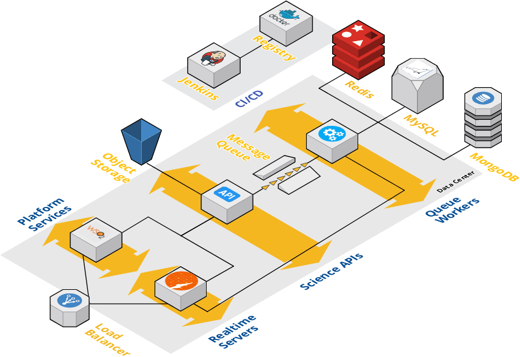
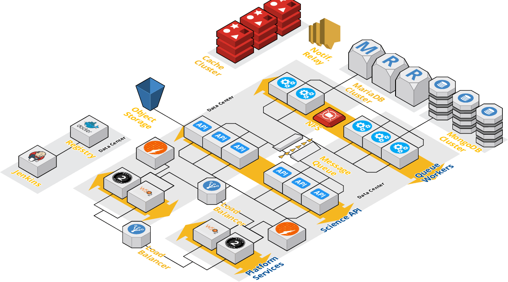

=========
Overview
=========

Agave is designed as a distributed microservice architecture, orchestrated as a collection of Docker containers. The platform conceptually breaks down into three logical set of components:

=================== =======================================================
 Component Group     Description
=================== =======================================================
 Authentication      Identity and authentication services, API management,
                     and higher-level administration services.
 Core Science APIs   REST services providing the Science-as-a-Service
                     capabilities to the platform such as job management,
                     data movement, metadata services, app registration,
                     notifications, etc.
 Infrastructure      Persistence and support services.
=================== ======================================

=========================================
What Is the Agave Platform Architecture?
=========================================

Agave’s multi-tenant capability comes from its ability to securely serve multiple tenants from a single deployment of the platform. A tenant is a group of users, usually representing a community or organization, who share access to a common configuration of the platform. Within a tenant, IAM, data, services, documentation, and global default settings are configured for all users. Typically, a single Agave tenant will support tens to hundreds of client applications and thousands of users with no additional configuration.

Individual tenants can be scaled from a minimal sandbox installation to high-availability, shared installation spanning multiple data centers. Figures 1 shows a basic sandbox deployment of the platform. Roughly 50 containers will be started across 3 hosts. One host for platform services, another for core Science APIs, and another for persistence and infrastructure services.

In practice, most tenants do some capacity planning up front, then adjust their static footprint to handle 80-90% of peak throughput at any given moment. Adding additional workers, load balancing the Identity Server, API Manager, and Science APIs, clustering the relational databases, and sharding the nosql server for better capacity and performance are standard steps when operating higher capacity tenants. The architecture in Figure 2 shows a production deployment scaled in this manner across 20+ hosts. With this architecture, upwards of 200 containers would be running at a given time. Given sufficient networking, such a deployment would be capable of moving upwards of a Petabyte of data, managing 100s of thousand of jobs, and serving 10s of millions of requests per day across one or more tenants. It is important to note that while most of these tasks can be automated by the Agave's Deployer playbooks, local database and system administrators should be included in the process.

